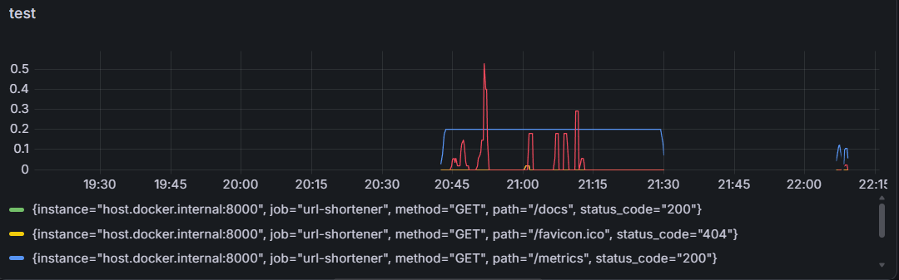
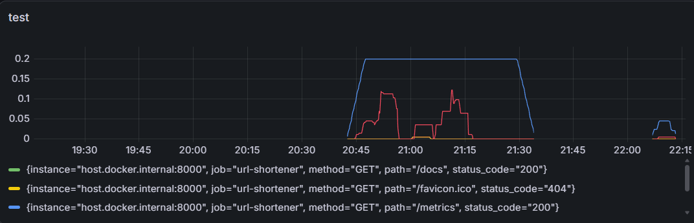
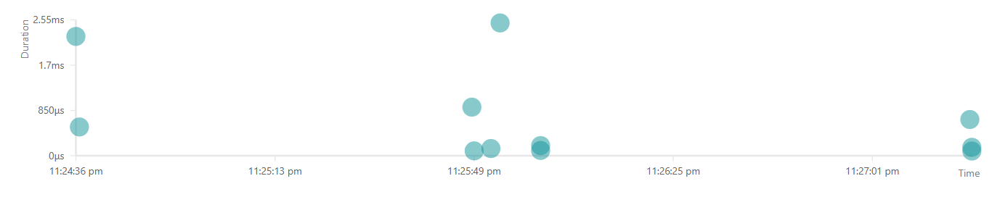
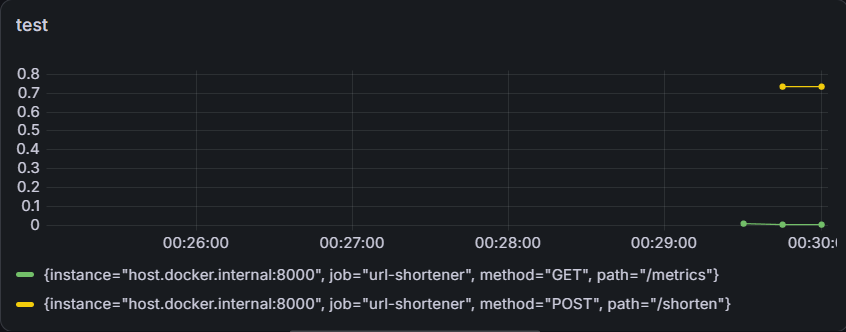
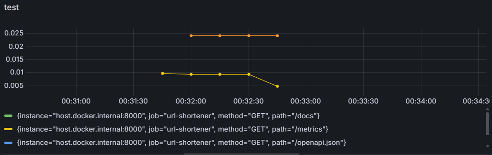

# URL Shortener API


A production-ready URL shortening service inspired by **Bitly**, built with **FastAPI**.

This project demonstrates backend API development, database integration, rate limiting, automated testing, structured logging, metrics collection, and distributed tracing using industry-standard observability tools.

---

# Dashboard Preview

<p align="center">
  
  
</p>

<p align="center">
  
</p>

<p align="center">
<i>Real-time monitoring dashboards and distributed request tracing.</i>
</p>

---

# Features

- Shorten long URLs into shareable links
- Track click counts and creation timestamps
- Token Bucket rate limiting
- Prometheus metrics collection
- Grafana monitoring dashboards
- Distributed tracing with Jaeger
- Structured JSON logging with structlog
- Automated testing using pytest

---

# Tech Stack

| Category | Technologies |
|----------|--------------|
| Backend | FastAPI |
| Database | SQLite, SQLAlchemy |
| Monitoring | Prometheus, Grafana |
| Tracing | OpenTelemetry, Jaeger |
| Logging | structlog |
| Testing | pytest |
| Containerization | Docker Compose |

---

# Project Structure

```text
url-shortener/
├── app/
│   ├── __init__.py
│   ├── main.py            # API endpoints + middleware
│   ├── database.py        # SQLAlchemy setup
│   └── models.py          # Database table definitions
│
├── tests/
│   └── test_api.py
│
├── images/
├── docker-compose.yml
├── prometheus.yml
├── requirements.txt
└── README.md
```

---

# Quick Start

## Prerequisites

- Python 3.11+
- Docker Desktop

## Installation

Clone the repository.

```bash
git clone https://github.com/lithasz/url-shortener.git
cd url-shortener
```

Create a virtual environment.

### Windows

```bash
python -m venv venv
venv\Scripts\activate
```

### macOS / Linux

```bash
python3 -m venv venv
source venv/bin/activate
```

Install dependencies.

```bash
pip install -r requirements.txt
```

Run the FastAPI application.

```bash
uvicorn app.main:app --reload
```

Start Prometheus, Grafana, and Jaeger.

```bash
docker compose up -d
```

---

# Access the Services

- FastAPI Documentation | http://localhost:8000/docs |
- Prometheus | http://localhost:9090 |
- Grafana | http://localhost:3000 |
- Jaeger | http://localhost:16686 |

---

# Architecture

```text
                        ┌──────────────┐
                        │    Client    │
                        └──────┬───────┘
                               │
                               ▼
                 ┌────────────────────────┐
                 │      FastAPI App       │
                 │ (with rate limiting)   │
                 └──────────┬─────────────┘
                            │
          ┌─────────────────┴──────────────────┐
          │                                    │
          ▼                                    ▼
 ┌──────────────────┐                 ┌──────────────────┐
 │    SQLite DB     │                 │   Observability  │
 │  (shortener.db)  │                 └────────┬─────────┘
 └──────────────────┘                          │
                                               │
              ┌──────────────┬─────────────────┼─────────────────┐
              ▼              ▼                 ▼                 ▼
      ┌────────────┐  ┌────────────┐  ┌────────────┐  ┌────────────┐
      │ Prometheus │  │  Grafana   │  │   Jaeger   │  │ structlog  │
      └────────────┘  └────────────┘  └────────────┘  └────────────┘
```

The application consists of several components working together:

- **FastAPI** exposes the REST API and handles request routing.
- **SQLite** stores shortened URLs and click statistics.
- **Prometheus** scrapes metrics from the `/metrics` endpoint.
- **Grafana** visualizes metrics through real-time dashboards.
- **Jaeger** collects distributed traces for performance analysis.
- **structlog** produces structured JSON logs for debugging and monitoring.

---

# API Endpoints

- POST | `/shorten` | Create a shortened URL |
- GET | `/{code}` | Redirect to the original URL |
- GET | `/stats/{code}` | Retrieve click statistics |
- GET | `/metrics` | Prometheus metrics endpoint |

---

# Rate Limiting

The API implements a **Token Bucket** algorithm to prevent abuse.

Configuration:

- Bucket capacity: **5 tokens**
- Refill rate: **1 token per second**
- Cost per request: **1 token**

This allows short bursts of requests while limiting sustained high traffic.

When a client exceeds the rate limit, the API returns:

```http
HTTP 429 Too Many Requests
```

until new tokens become available.

---

# Monitoring

## Grafana

Grafana visualizes Prometheus metrics in real time.

The dashboards display:

- Request throughput
- HTTP status codes
- Average request latency
- p50, p95, and p99 latency percentiles
- Error rates

<p align="center">
  
  
</p>

---

## Distributed Tracing

Jaeger records every request using OpenTelemetry.

Each trace shows:

- Total request duration
- Database execution time
- Middleware execution
- Individual request spans

<p align="center">
  
</p>

---

## Correlating Metrics and Traces
To demonstrate how monitoring helps identify bottlenecks, I intentionally introduced a 
`time.sleep(0.5)` delay in the `/shorten` endpoint to simulate a slow database query.

**Before (with artificial delay):**


The p95 latency for `/shorten` jumped to ~700ms, clearly visible in the Grafana dashboard.

**After (removed the delay):**


After removing the delay, latency dropped back to ~23ms. This "find it → fix it → prove it" 
workflow demonstrates how metrics and distributed tracing complement each other when 
diagnosing performance bottlenecks in production systems.


---

# Testing

Run the automated test suite.

```bash
pytest
```

The tests cover:

- URL shortening
- URL redirection
- Statistics endpoint
- Invalid URL handling
- Rate limiting behavior

---

# Future Improvements

- PostgreSQL support
- Redis caching
- Custom short URL aliases
- URL expiration
- User authentication
- CI/CD with GitHub Actions
- Kubernetes deployment

---

# What I Learned

Building this project gave me hands-on experience with:

- Designing REST APIs using FastAPI
- Database integration with SQLAlchemy
- Implementing a Token Bucket rate limiter
- Structured logging with structlog
- Metrics collection using Prometheus
- Building Grafana dashboards
- Distributed tracing with OpenTelemetry and Jaeger
- Writing automated backend tests
- Building production-ready backend services

---

## License
This project was built for learning and portfolio purposes.
